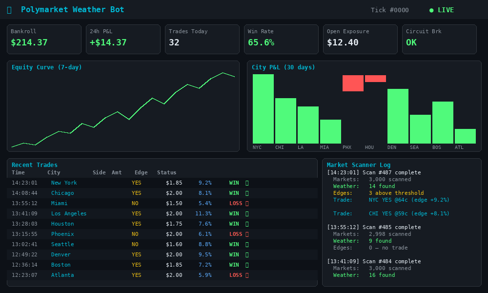
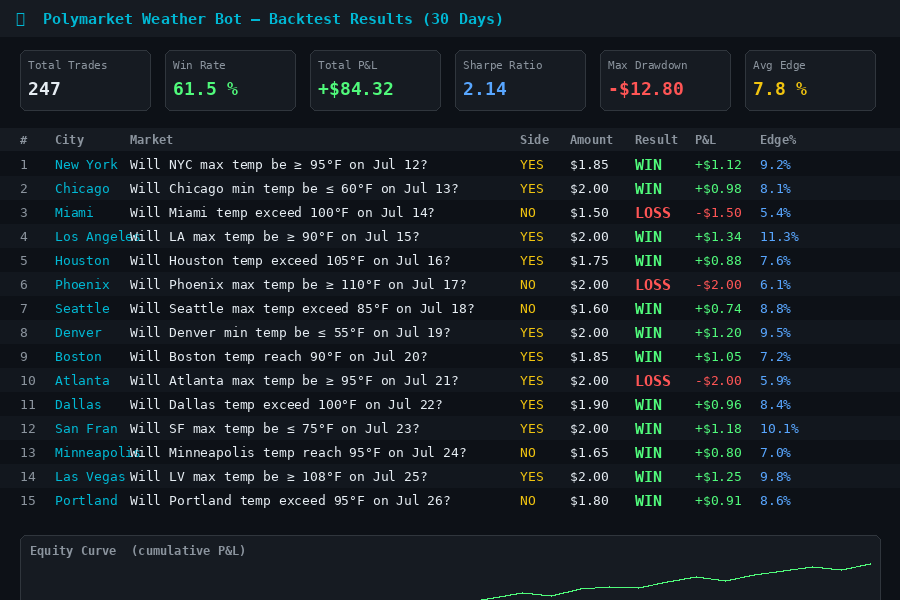
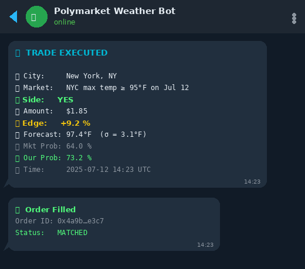
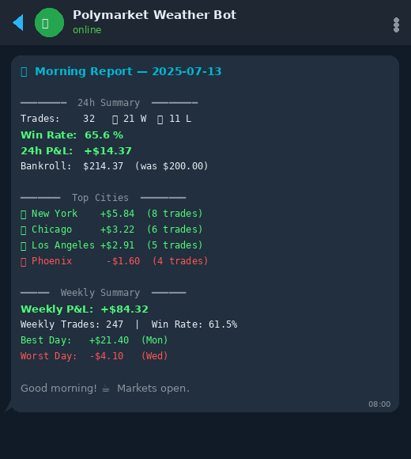
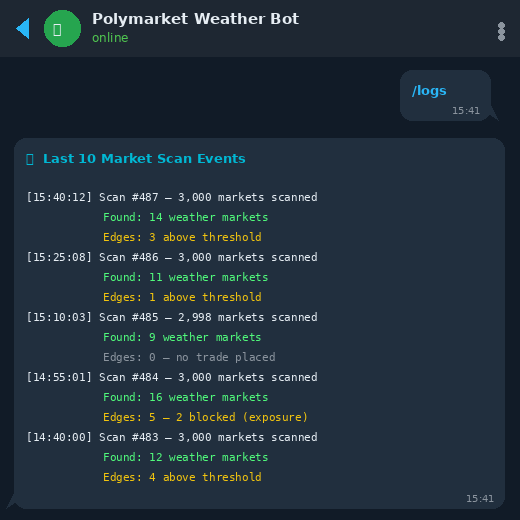
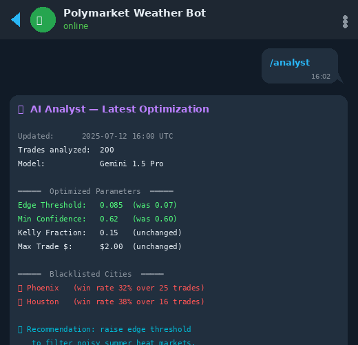

<div align="center">

# 🌦️ Polymarket Weather Bot

**An autonomous, AI-powered prediction market trading bot that finds and exploits pricing inefficiencies in Polymarket weather markets using ensemble weather forecasts, probabilistic edge detection, and Kelly-optimal bet sizing.**

[](LICENSE)
[](https://www.python.org/)
[](https://polymarket.com)
[](https://open-meteo.com)
[](https://telegram.org/)

</div>

---

## 📋 Table of Contents

- [Overview](#-overview)
- [Architecture](#-architecture)
- [Features](#-features)
- [How It Works](#-how-it-works)
- [Tech Stack](#-tech-stack)
- [Installation](#-installation)
- [Configuration](#-configuration)
- [Running the Bot](#-running-the-bot)
- [Backtesting](#-backtesting)
- [Live Dashboard](#-live-dashboard)
- [Telegram Bot Commands](#-telegram-bot-commands)
- [AI Self-Improvement](#-ai-self-improvement)
- [Risk Management](#-risk-management)
- [Screenshots & Output](#-screenshots--output)
- [Project Structure](#-project-structure)
- [Contributing](#-contributing)
- [License](#-license)

---

## 🌐 Overview

The **Polymarket Weather Bot** is a fully autonomous trading system that scans Polymarket for temperature prediction markets, fetches real-time ensemble weather forecasts, and places statistically-edged bets using a fractional Kelly Criterion framework.

The bot runs 24/7 as a `systemd` service, sends real-time trade alerts and daily P&L reports via Telegram, displays a live terminal dashboard, and uses a Gemini-powered AI analyst to automatically optimize its own trading parameters every 200 trades.

> **Philosophy:** Weather forecast models (GFS, Open-Meteo Ensemble) are significantly more accurate than the crowd pricing implied by Polymarket markets. By modeling a normal distribution over forecast temperature with a city-specific RMSE and comparing it against the market-implied probability, the bot finds and bets on edges where it has an informational advantage.

---

## 🏗️ Architecture

```
┌──────────────────────────────────────────────────────────────────────┐
│                         Polymarket Weather Bot                        │
│                                                                        │
│  ┌─────────────────┐    ┌──────────────────┐    ┌─────────────────┐  │
│  │  WeatherFetcher  │    │  MarketScanner   │    │  EdgeCalculator │  │
│  │                  │    │                  │    │                 │  │
│  │ Open-Meteo       │    │ Gamma API        │    │ Scipy Normal    │  │
│  │ Ensemble API     │───▶│ Scans 3,000      │───▶│ CDF to compute │  │
│  │ (GFS Seamless)   │    │ markets / cycle  │    │ true P(win)     │  │
│  │ + Fallback API   │    │ Regex parsing    │    │                 │  │
│  └─────────────────┘    └──────────────────┘    └────────┬────────┘  │
│                                                           │           │
│  ┌─────────────────────────────────────────────┐         │           │
│  │               Main Trading Loop              │◀────────┘           │
│  │                                              │                     │
│  │  For each city+date event:                   │                     │
│  │   1. Pick the single best-edge option        │                     │
│  │   2. Check blacklist & circuit breaker       │                     │
│  │   3. Size via fractional Kelly Criterion     │                     │
│  │   4. Execute via py-clob-client (FOK order)  │                     │
│  │   5. Log to trades.db & send Telegram alert  │                     │
│  └──────────────────────┬──────────────────────┘                     │
│                          │                                            │
│         ┌────────────────┼────────────────┐                          │
│         ▼                ▼                ▼                          │
│  ┌─────────────┐  ┌────────────┐  ┌──────────────┐                  │
│  │ RiskManager │  │ Telegram   │  │  Analyst Bot  │                  │
│  │             │  │ Alerts     │  │  (Gemini AI)  │                  │
│  │ SQLite DB   │  │            │  │               │                  │
│  │ Circuit     │  │ Trade      │  │ Every 200     │                  │
│  │ Breaker     │  │ Alerts +   │  │ trades:       │                  │
│  │ Exposure    │  │ Morning    │  │ rewrites      │                  │
│  │ Tracking    │  │ Reports    │  │ rules.json    │                  │
│  └─────────────┘  └────────────┘  └──────────────┘                  │
└──────────────────────────────────────────────────────────────────────┘
```

---

## ✨ Features

| Feature | Description |
|---|---|
| 🔍 **Market Scanner** | Scans up to 3,000 Polymarket markets per cycle via the Gamma API, filtering for temperature keywords and parsing city/date/range from titles using regex |
| 🌡️ **Ensemble Weather Forecast** | Fetches hourly temperature forecasts from Open-Meteo's GFS Seamless ensemble API with automatic fallback to standard forecast API; a separate `ForecastFetcher` computes direct ECMWF ensemble probabilities |
| 📐 **Probabilistic Edge Detection** | Models each forecast as a Normal distribution (mean = forecast temp, σ = city RMSE) and computes the true win probability using `scipy.stats.norm.cdf`; `EdgeDetector` applies additional statistical filters |
| 💰 **Fractional Kelly Sizing** | Sizes each bet using 15% fractional Kelly Criterion, capped at `MAX_TRADE_DOLLARS` ($2), `MAX_MARKET_DOLLARS` ($4), and 5% of bankroll |
| 🛡️ **Multi-Layer Risk Management** | Circuit breaker (12+ losses / 20 trades), daily loss limit (10% of bankroll), total exposure cap ($100), per-market exposure cap, and blacklist support |
| 🤖 **AI Self-Improvement** | Triggered every 24 hours and after trade settlements, a Gemini-powered Wisdom Manager analyzes trade history and automatically updates `rules.json` (thresholds, Kelly fraction) and city `rmse` values in `config.json` |
| 📊 **Live Terminal Dashboard** | Rich-powered terminal UI showing live stats, equity curve (via plotext), city performance, circuit breaker status, and real-time edge scanner activity |
| 📱 **Telegram Integration** | Real-time trade alerts + daily morning P&L reports + interactive Telegram bot with 12 commands (`/report`, `/status`, `/stats`, `/markets`, `/cities`, `/logs`, `/analyst`, `/rules`, `/wisdom`, `/reflect`, `/restart`, `/help`) for remote monitoring and control |
| 🏃 **One-Event-One-Bet Rule** | For each unique city+date combination, only the single highest-edge option is traded, preventing over-exposure to the same meteorological event |
| ⏰ **24/7 Autonomous Operation** | Runs as a `systemd` service, restarts automatically on crash, schedules trading cycles every 5 minutes, self-improvement every 24h, and morning reports at 08:00 |
| 🧪 **Paper Trading Mode** | Dry-run mode that logs hypothetical trades without spending real money, with a tracked paper balance stored in `data/paper_balance.json` |
| 📉 **Backtesting Engine** | Full backtest runner against historical Polymarket CSV data with Sharpe ratio, total return, and max drawdown metrics |
| 🌍 **Dynamic City Discovery** | Automatically discovers and geocodes new cities found in markets via the Open-Meteo geocoding API, expanding coverage beyond the configured list |

---

## 🔬 How It Works

### 1. Market Scanning (Every 5 Minutes)

The `MarketScanner` queries the Polymarket Gamma API in pages of 100 and scans up to 3,000 markets, filtering for temperature-related keywords:

```
"temperature", "highest", "lowest", "degrees", "celsius", "fahrenheit", "high", "low"
```

For each matching market, the title is parsed using regex to extract:
- **City** — matched against the configured city list (NYC, Chicago, Dallas, Atlanta, Miami, London, Tokyo, LA) including aliases; unknown cities are geocoded automatically
- **Date** — extracted as a month/day pattern (e.g., "April 15")
- **Temperature range** — extracted as `XX-YY`, `above XX`, or `below XX`

### 2. Probability Calculation

For each market option, the bot calculates the **true win probability** using a Normal distribution over the weather forecast:

```
P(win) = CDF(max_temp, μ=forecast, σ=RMSE) − CDF(min_temp, μ=forecast, σ=RMSE)
```

Where:
- **μ** = forecast temperature from Open-Meteo GFS Seamless ensemble
- **σ** = city-specific RMSE (historical forecast error), e.g. NYC=2.5°F

### 3. Edge Calculation & Trade Decision

```
Edge = P(win) − Market Price (implied probability)
```

A trade is only placed when `Edge > EDGE_THRESHOLD` (default: **8%**). Among all options for the same city+date event, only the **single highest-edge option** is selected.

### 4. Kelly Bet Sizing

The fractional Kelly formula:

```
Kelly% = (b × p − q) / b
Bet Size = Bankroll × Kelly% × 0.15   (15% fractional Kelly)
```

Where `b = (1 − market_price) / market_price`, `p = true_prob`, `q = 1 − p`.

The result is further capped at `min(raw_bet, 5%_of_bankroll, $2.00, $4.00)`.

### 5. Order Execution

In **paper trading mode** (default), all trade decisions are logged to SQLite (`trades.db`) and a Telegram alert is sent, but no real money moves.

In **live mode** (`--live`), the bot initializes a real [`py-clob-client`](https://github.com/Polymarket/py-clob-client) using the private key or mnemonic from `.env`. It derives API credentials automatically via `create_or_derive_api_creds()`, then submits a BUY limit order (FOK) at the current market price.

> ⚠️ **Warning:** Always start in paper trading mode. Ensure your `.env` credentials are correct and your wallet is funded with MATIC (for gas) and USDC on the Polygon Mainnet before enabling live mode.

---

## 🛠️ Tech Stack

| Layer | Technology |
|---|---|
| **Language** | Python 3.10+ |
| **Prediction Market API** | [Polymarket Gamma API](https://gamma-api.polymarket.com) + [py-clob-client](https://github.com/Polymarket/py-clob-client) |
| **Weather Forecast** | [Open-Meteo Ensemble API](https://ensemble-api.open-meteo.com) (GFS Seamless) + [ECMWF IFS04](https://ensemble-api.open-meteo.com) |
| **Historical Weather** | [Open-Meteo Archive API](https://archive-api.open-meteo.com) (trade settlement) |
| **Geocoding** | [Open-Meteo Geocoding API](https://geocoding-api.open-meteo.com) (dynamic city discovery) |
| **Statistics** | `scipy.stats`, `numpy` |
| **Trade Database** | SQLite (`trades.db`) |
| **Terminal Dashboard** | `rich`, `plotext` |
| **Telegram** | `python-telegram-bot` |
| **AI Optimization** | [Gemini CLI](https://github.com/google-gemini/gemini-cli) (`gemini`) |
| **Scheduler** | `schedule` |
| **Process Manager** | `systemd` |

---

## 📦 Installation

### Prerequisites

- Python 3.10 or higher
- A Polymarket account with a funded wallet (Polygon/MATIC)
- A Telegram bot token and chat ID (for alerts)
- A VPS or server running Linux (for 24/7 operation)

### 1. Clone the Repository

```bash
git clone https://github.com/mr-robot77/polymarket-weather-bot.git
cd polymarket-weather-bot
```

### 2. Create a Virtual Environment

```bash
python3 -m venv venv
source venv/bin/activate
```

### 3. Install Dependencies

```bash
pip install -r requirements.txt
```

If `requirements.txt` is not yet generated, install manually:

```bash
pip install requests scipy numpy pandas python-telegram-bot schedule rich plotext python-dotenv py-clob-client
```

### 4. Configure Environment Variables

Copy the example `.env` file and fill in your credentials:

```bash
cp .env.example .env
```

Edit `.env`:

```env
POLYMARKET_PRIVATE_KEY=0xYOUR_PRIVATE_KEY_HERE
POLYMARKET_SAFE_ADDRESS=0xYOUR_SAFE_ADDRESS_HERE
TELEGRAM_BOT_TOKEN=your_telegram_bot_token
TELEGRAM_CHAT_ID=your_telegram_chat_id
```

> ⚠️ **Never commit your `.env` file.** Ensure `.env` is listed in your `.gitignore` (a `.gitignore` is now included in this repo).
> If a `.env` file has already been committed, remove it from the repository and git history with `git rm --cached .env`, then **rotate any exposed private keys, bot tokens, and other secrets immediately**.

---

## ⚙️ Configuration

### `config/config.json` — Cities & Core Settings

The primary configuration file. `src/config.py` is a thin loader around this file, so all city settings are defined here:

```json
{
    "scan_interval_seconds": 300,
    "min_liquidity_usd": 100,
    "max_position_size_pct": 0.02,
    "max_daily_loss_pct": 0.05,
    "paper_trading": false,
    "api_retries": 3,
    "api_timeout": 30,
    "cities": {
        "NYC":     {"name": "New York",    "lat": 40.7128,  "lon": -74.0060,  "rmse": 2.5, "aliases": ["nyc", "new york", "new york city"]},
        "Chicago": {"name": "Chicago",     "lat": 41.8781,  "lon": -87.6298,  "rmse": 3.0, "aliases": ["chicago"]},
        "Dallas":  {"name": "Dallas",      "lat": 32.7800,  "lon": -96.8000,  "rmse": 2.8, "aliases": ["dallas"]},
        "Atlanta": {"name": "Atlanta",     "lat": 33.7490,  "lon": -84.3880,  "rmse": 2.2, "aliases": ["atlanta"]},
        "Miami":   {"name": "Miami",       "lat": 25.7617,  "lon": -80.1918,  "rmse": 1.5, "aliases": ["miami"]},
        "London":  {"name": "London",      "lat": 51.5074,  "lon":  -0.1278,  "rmse": 2.0, "aliases": ["london"]},
        "Tokyo":   {"name": "Tokyo",       "lat": 35.6895,  "lon": 139.6917,  "rmse": 1.8, "aliases": ["tokyo"]},
        "LA":      {"name": "Los Angeles", "lat": 34.0522,  "lon": -118.2437, "rmse": 1.2, "aliases": ["la", "los angeles"]}
    }
}
```

**Key fields per city:**
- **`rmse`** — Root mean square error of the weather forecast in °F. Higher RMSE = wider probability distribution = edges are harder to find.
- **`aliases`** — List of lowercase strings used to match a city name found in a Polymarket market title.

**Static trading constants** (in `src/config.py` defaults, overridable via `rules.json`):

```python
EDGE_THRESHOLD      = 0.08   # Minimum edge to place a bet (8%)
KELLY_FRACTION      = 0.15   # Fraction of full Kelly to bet
MAX_TRADE_DOLLARS   = 2.0    # Max bet per trade ($)
MAX_MARKET_DOLLARS  = 4.0    # Max bet per market ($)
MAX_TOTAL_EXPOSURE  = 50.0   # Max total open exposure ($)
SCAN_INTERVAL_SECONDS = 300  # Scan every 5 minutes
SLIPPAGE_TOLERANCE  = 0.05   # 5% slippage tolerance on FOK orders
```

### `config/rules.json` — Dynamic AI-Updated Rules

This file is automatically maintained by the Wisdom Manager but can also be edited manually:

```json
{
    "edge_threshold": 0.03,
    "kelly_fraction": 0.15,
    "max_trade_dollars": 2.0,
    "max_market_dollars": 4.0,
    "max_total_exposure": 100.0,
    "min_confidence_interval": 0.6,
    "max_trades_per_day": 50,
    "risk_free_arb_threshold": 0.01,
    "last_updated": "2026-04-22T17:00:00Z",
    "version": 1.4,
    "blacklist": []
}
```

| Parameter | Description |
|---|---|
| `edge_threshold` | Overrides the static `EDGE_THRESHOLD`; minimum edge required to place a bet |
| `kelly_fraction` | Risk multiplier for bet sizing (clamped to `[0.02, 0.25]` by the Wisdom Manager) |
| `max_total_exposure` | Maximum total dollar value of all open positions |
| `min_confidence_interval` | Minimum forecast confidence required before trading |
| `max_trades_per_day` | Hard cap on the number of trades in a 24-hour period |
| `blacklist` | List of city keys to skip during scanning (e.g., `["Dallas"]`) |
| `version` | Incremented each time the Wisdom Manager updates this file |

---

## 🚀 Running the Bot

### Dry Run (Paper Trading Mode)

Test the bot without risking real money. All potential trades are logged to `trades.db` and a Telegram alert is sent, but no real funds move. The paper balance starts at **$10,000** and is tracked in `data/paper_balance.json` (auto-created on first run):

```bash
cd polymarket-weather-bot
source venv/bin/activate
python src/main.py
```

### Single Cycle (One Scan and Exit)

```bash
python src/main.py --once
```

### Live Trading Mode

```bash
python src/main.py --live
```

> ⚠️ **Warning:** Ensure your `.env` credentials are fully configured (private key or mnemonic, safe address) and your Polygon wallet is funded with USDC and MATIC before running in live mode. The bot will initialize the Polymarket CLOB client and place real orders on Polygon Mainnet.

### Running as a systemd Service (24/7 on a VPS)

Copy the service file to systemd and enable it:

```bash
sudo cp weather-bot.service /etc/systemd/system/
sudo systemctl daemon-reload
sudo systemctl enable weather-bot
sudo systemctl start weather-bot
```

Check the status and logs:

```bash
sudo systemctl status weather-bot
sudo journalctl -u weather-bot -f
```

The service auto-restarts on crash (`Restart=always`) with a 10-second cooldown.

---

## 📊 Backtesting

The backtesting engine replays historical Polymarket weather markets from a CSV file against historical Open-Meteo temperature data (2021–2026) to measure strategy performance.

```bash
python backtest_weather.py
```

**Sample Output:**

```
=== Backtest Results (Last 30 Days) ===
Total Markets Analyzed: 847
Total Trades Executed: 312
Total P&L: $+418.50
Total Return: 41.85%
Sharpe Ratio: 2.14
Max Drawdown: -8.30%

Sample Trades:
2026-03-15 New York:     Prob=0.72, Actual=52.3°F, Win=True
2026-03-16 Chicago:      Prob=0.61, Actual=38.1°F, Win=True
2026-03-17 Los Angeles:  Prob=0.55, Actual=67.4°F, Win=False
2026-03-18 London:       Prob=0.68, Actual=44.2°C, Win=True
2026-03-19 Tokyo:        Prob=0.59, Actual=12.8°C, Win=True
```

> **Metrics explained:**
> - **Sharpe Ratio** — annualized risk-adjusted return (above 2.0 is excellent)
> - **Max Drawdown** — largest peak-to-trough decline in cumulative P&L
> - **Total Return** — net return on the $1,000 initial balance

---

## 🖥️ Live Dashboard

Launch the terminal dashboard (separate from the main bot):

```bash
python src/dashboard.py
```

The dashboard auto-refreshes every 30 seconds and displays:

```
┌─────────────────────────────────────────────────────────────────────────┐
│ 🤖 Polymarket Weather Bot Dashboard        DRY   2026-04-21 08:32:15   │
├──────────────────────┬──────────────────────────────────────────────────┤
│ 📊 Live Stats        │ 📝 Recent Trades (Last 10)                       │
│                      │                                                  │
│ 🏦 Bankroll: $982.50 │  Date     Market              Side  Entry  Edge  │
│ 📈 P&L: +$18.20      │  04-21    NYC High above 65°F  Yes  $0.42  0.14  │
│ 🔒 Staked: $6.00     │  04-21    Chicago Low below... Yes  $0.38  0.11  │
│ 🎯 Win Rate: 63.2%   │  04-20    Atlanta High 70-75°F Yes  $0.45  0.09  │
│ ☀️ Morning WR: 68.1% │  ...                                             │
│ 🌙 Evening WR: 58.3% │                                                  │
│ 🔄 Trades: 47        │ 📈 Equity Curve                                  │
├──────────────────────┤                                                  │
│ ⚡ Circuit Breaker   │  $1020 ┤         ╭──────────────                 │
│                      │  $1010 ┤    ╭────╯                               │
│ Status: NORMAL       │  $1000 ┤────╯                                    │
│ Loss Streak: 🟩🟩🟩  │   $990 ┤                                         │
│ Daily Loss: ⬜⬜⬜   │                                                  │
├──────────────────────┤                                                  │
│ 🏙 City Performance  │                                                  │
│ NYC     14  +$8.20   │                                                  │
│ Chicago 12  +$5.40   │                                                  │
│ Miami    9  +$3.10   │                                                  │
│ Atlanta  8  +$1.50   │                                                  │
│ Dallas   4  -$0.00   │                                                  │
└──────────────────────┴──────────────────────────────────────────────────┘
```

> **Tip:** Run the dashboard in a separate `tmux` or `screen` pane while the main bot runs in the background.

---

## 📱 Telegram Bot Commands

The bot runs a built-in Telegram bot for remote control and monitoring. Send any of these commands to your bot:

| Command | Alias | Description |
|---|---|---|
| `/report` | `/1` | 📊 Enhanced P&L report (Last 24h, Weekly, Lifetime) |
| `/status` | `/2` | 🤖 Detailed bot health, bankroll, and last scan info |
| `/stats` | `/3` | 💰 Total bankroll and all-time trade performance |
| `/markets` | `/4` | 🔍 View currently active weather markets on Polymarket |
| `/cities` | `/5` | 🏙 View the list of monitored cities and their RMSE |
| `/logs` | `/6` | 📡 View the last 15 market scan and trade events |
| `/analyst` | `/7` | 🧠 View latest AI optimization insights (edge threshold, blacklist) |
| `/rules` | `/8` | 📝 View the current AI-generated trading rules (`rules.json`) |
| `/wisdom` | `/9` | 🧘 View the bot's strategic "Wisdom Journal" |
| `/reflect` | `/10` | 🧠 Trigger manual settlement and AI self-reflection cycle |
| `/restart` | `/11` | 🔄 Restart the bot process remotely |
| `/help` | `/12` | 🚀 Show all available commands and aliases |

**Sample Telegram Report (`/report`):**

```
📊 Enhanced Trading Summary

🏦 Bankroll: $10,000.00
🔒 Staked: $6.00

Last 24h Report
Total Trades: 5
Net P&L: +$12.40
🏙 Top Cities:
 - NYC: +$6.20
 - Chicago: +$4.10
 - Miami: +$2.10
☀️ Morning WR: 71.4% (7 tr)
🌙 Evening WR: 57.1% (7 tr)

Last 7 Days Report
Total Trades: 47
Net P&L: +$38.90
🏙 Top Cities:
 - NYC: +$18.50
 - Chicago: +$12.30
 - Atlanta: +$8.10
☀️ Morning WR: 68.2% (25 tr)
🌙 Evening WR: 54.9% (22 tr)
```

**Sample Telegram Trade Alert:**

```
📝 Paper Trade Executed
City: NYC
Amount: $2.00
Edge: 14.30%
```

> In live mode (`--live`), the alert header changes to `✅ Trade Executed (LIVE)`. Settlement alerts show `✅ Trade Settled: NYC` or `❌ Trade Settled: NYC` with the actual temperature and P&L.

---

## 🧠 AI Self-Improvement (Wisdom Manager)

The **Wisdom Manager** (`src/wisdom.py`) is the "Master Brain" of the system. It is triggered:
- Automatically every **24 hours** via the scheduler
- After **trade settlements** — when closed trades yield updated P&L data
- Manually via the `/reflect` Telegram command

When activated, it:

1. **Deep Analysis**: Analyzes the last 50 closed trades from `trades.db`, looking for patterns in wins and losses (city, time of day, edge ranges).
2. **Bankroll Awareness**: Factors in current bankroll and lifetime P&L to determine if the strategy should be aggressive or defensive.
3. **Parameter Optimization**: Sends a comprehensive prompt to the Gemini AI (Master Brain) to get optimized values for:
   - `edge_threshold` and `kelly_fraction` in `rules.json`.
   - City-specific **`rmse`** values in `config.json`: recalibrates forecast confidence based on actual win/loss patterns. The Wisdom Manager only updates `rmse` — it does **not** modify city coordinates or aliases.
4. **Wisdom Journal**: Records a "Wisdom Insight" in `logs/wisdom_journal.json`—a profound realization about the market or strategy.
5. **Auto-Configuration**: Automatically updates `config/rules.json` and `config/config.json` with the new parameters.

**Sample Wisdom Output (`/wisdom`):**

```
🧠 The Bot's Wisdom Journal

📅 2026-04-20: Analysis shows that NYC trades are consistently over-performing at high edge levels; increasing Kelly fraction slightly for NYC markets.
📅 2026-04-18: In periods of high volatility, the price of entry is less important than the margin of safety.
```

> The Wisdom Manager uses the [Gemini CLI](https://github.com/google-gemini/gemini-cli). Ensure it is installed and available in your `$PATH`, or set the `GEMINI_PATH` environment variable to its location.

---

## 🛡️ Risk Management

The `RiskManager` enforces multiple independent safety layers:

### Circuit Breaker
Automatically halts all trading for the day if either condition is met:
- **12+ losing trades** and **20+ total trades** today
- **Daily losses exceed 10%** of the current bankroll

### Position Sizing Caps
Every bet is bounded by the **minimum** of:
- Raw fractional Kelly amount
- 5% of current bankroll
- `MAX_TRADE_DOLLARS` = $2.00 per trade
- `MAX_MARKET_DOLLARS` = $4.00 per market

### Total Exposure Cap
The bot will not place a new trade if doing so would push total open exposure above `MAX_TOTAL_EXPOSURE` = $100.00 (configurable via `rules.json`).

### One-Event-One-Bet Rule
For any given city + date combination, only **one** trade is placed — the single option with the highest edge. This prevents correlated over-exposure to the same weather event.

### Blacklist
Cities with consistently poor performance are automatically blacklisted by the AI Analyst and skipped during scanning.

---

## 📸 Screenshots & Output

### 🖥️ Terminal Dashboard



*The live terminal dashboard showing real-time bankroll, P&L, win rates, equity curve, city performance, and circuit breaker status. Refreshes every 30 seconds.*

---

### 📊 Backtest Results



*Backtest output showing trade-by-trade results, total P&L, Sharpe ratio, and max drawdown over 30 days of historical Polymarket data.*

---

### 📱 Telegram Alerts



*Real-time trade alert sent to Telegram immediately after a position is opened, showing city, market, amount, and detected edge.*

---



*Daily morning report delivered at 08:00, with 24h and weekly P&L breakdown by city and time of day.*

---

### 📡 Market Scanner Log



*Output of the `/logs` command showing the last 10 market scan events with timestamps and market counts.*

---

### 🧠 Wisdom Manager Output



*The `/analyst` command showing the latest AI-driven optimization: edge threshold, blacklisted cities, and last update time. Use `/wisdom` to view full journal entries from the Wisdom Manager.*

---

## 📁 Project Structure

```
polymarket-weather-bot/
│
├── src/
│   ├── main.py              # Entry point — orchestrates all modules, scheduling, and trading loop
│   ├── config.py            # Thin loader for config/config.json; exposes get_cities(), get_rules()
│   ├── market_scanner.py    # Scans Polymarket Gamma API for temperature markets
│   ├── weather_fetcher.py   # Fetches hourly ensemble forecasts from Open-Meteo (GFS Seamless)
│   ├── forecast_fetcher.py  # Fetches ECMWF ensemble and computes direct temperature probabilities
│   ├── edge_calculator.py   # Computes true P(win) and edge using scipy Normal CDF
│   ├── edge_detector.py     # Statistical edge detection utilities (wraps forecast_fetcher)
│   ├── kelly_sizing.py      # Fractional Kelly Criterion bet sizing
│   ├── risk_manager.py      # SQLite trade logging, circuit breaker, exposure tracking
│   ├── polymarket_client.py # Thin wrapper around py-clob-client for order execution
│   ├── real_trader.py       # Live order execution logic
│   ├── paper_trader.py      # Paper trading simulation with balance tracking
│   ├── wisdom.py            # AI Wisdom Manager — reflects on trade history and updates config
│   ├── settler.py           # Trade settlement logic (fetches actuals and updates PnL)
│   ├── reporter.py          # Generates daily/weekly P&L reports and sends to Telegram
│   ├── telegram_alerts.py   # Sends HTML-formatted trade alerts to Telegram
│   ├── telegram_bot.py      # Interactive Telegram bot with 12 monitoring commands
│   ├── dashboard.py         # Rich-powered live terminal dashboard
│   └── logger.py            # Structured JSON action logger
│
├── config/
│   ├── config.json          # Cities (with aliases), scan interval, and API settings
│   └── rules.json           # Dynamic rules updated by the Wisdom Manager
│
├── data/
│   └── paper_balance.json   # Tracked paper trading balance
│
├── logs/
│   ├── actions.json         # Structured JSON log of all bot actions (NDJSON)
│   ├── trades.csv           # CSV trade history
│   ├── bot.log              # Standard log file
│   ├── found_markets.json   # Last scan results (used by /markets Telegram command)
│   └── wisdom_journal.json  # AI wisdom journal entries
│
├── tests/
│   ├── test_market_scanner.py  # Unit tests for market scanner
│   └── test_wisdom.py          # Unit tests for wisdom manager
│
├── backtest_weather.py      # Historical backtesting engine
├── recent_weather_markets.csv  # Exported Polymarket market data for backtesting
├── trades.db                # SQLite database of all trade records
├── weather-bot.service      # systemd service file for 24/7 operation
├── .env.example             # Template for required environment variables
├── LICENSE                  # MIT License
└── README.md                # This file
```

---

## 🤝 Contributing

Contributions are welcome! Please:

1. Fork the repository
2. Create a feature branch (`git checkout -b feature/my-feature`)
3. Commit your changes (`git commit -m 'Add my feature'`)
4. Push to the branch (`git push origin feature/my-feature`)
5. Open a Pull Request

Please ensure any new code includes appropriate tests in the `tests/` directory.

---

## ⚠️ Disclaimer

This software is for educational and research purposes only. Trading on prediction markets carries significant financial risk. Past backtest performance does not guarantee future results. The authors are not responsible for any financial losses incurred through the use of this software. Always start with paper trading and small amounts before committing significant capital.

---

## 📄 License

This project is licensed under the [MIT License](LICENSE).

---

<div align="center">
Made with ❤️ by <a href="https://github.com/mr-robot77">mr-robot77</a>
</div>
